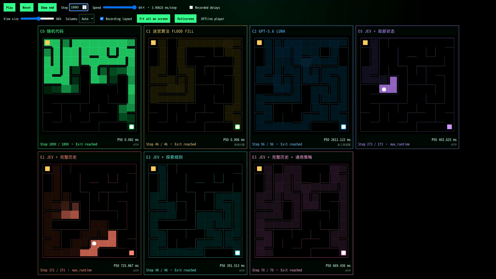

# Jev Quantum

[中文](README.md) | [English](README.en.md)

> The sub-microsecond System −1 model with Gaussian-distributed accuracy.

Jev Quantum is a Jev-compatible **random baseline**. It speaks the TypeSafe System One protocol (`noul` / `choice` / `score`), ignores the prompt, and answers from a fast PRNG. Use it as a dummy, a mock, or a lower bound for agent routing.

It is not a semantic model. The RNG is not cryptographic.

## Unknown-maze experiments: algorithms, Jev and an LLM

The repository also includes recorded comparisons on one **10×10 maze, seed 20260935**, examining how algorithms, exploration rules, history and general instructions affect decisions. The exit coordinates are known; walls are discovered through local observations.

[Watch the screen recording (2944×1840, 20.5 s)](reports/article-selected-seven.screencast.mp4) · [1080p condensed replay (16 s)](reports/article-selected-seven.replay.mp4) · [Experiment article (Chinese)](docs/jev-maze-article.md)

[](reports/article-selected-seven.screencast.mp4)

| Group | Method | Actions | Outcome | P50 (ms) |
| --- | --- | ---: | --- | ---: |
| C0 | Random code | 1890 | Exit reached | 0.082 |
| C1 | Online Flood Fill | 46 | Exit reached | 0.006 |
| C2 | GPT-5.6 Luna, persistent session | 96 | Exit reached | 2611.122 |
| E0 | Jev + local state | 273 | 10-minute budget exhausted | 402.625 |
| E1 | Jev + full history | 371 | 30-minute budget exhausted | 725.867 |
| E2 | Jev + exploration rules | 48 | Exit reached | 391.513 |
| E3 | Jev + full history + general strategy | 70 | Exit reached | 669.436 |

P50 is the median for the whole recording. C1 measures in-process computation; C2 includes tool orchestration; the other groups measure client-observed HTTP response time. These are different timing scopes, not a direct inference-speed ranking. Video playback follows accelerated action counts, not wall-clock runtime.

More history alone did not prevent loops in this run. Explicit exploration rules and revised general instructions both helped on this maze. E2 uses spatial statistics and exploration priorities, without full action history or BFS; E3 retains full history and removes distance-evaluation signals. One recorded run per group on one maze does not establish cross-seed reliability or a general ranking.

- [Seven-group report](reports/article-selected-seven.summary.json) and [standalone HTML player](reports/article-selected-seven.player.html): download the HTML and open it locally; no API key is needed.
- [All eleven versions](reports/0923showcase.eleven-strategies.summary.json) and [full player](reports/0923showcase.player.html), including earlier variants and ablations.
- The player supports fit-to-screen, scaling, step seeking, up to 64× playback, and per-group steps and P50.
- [Strategy details and limitations](docs/maze-strategies.md), [reproduction guide](docs/benchmarking.md), and [artifact index](reports/README.md).

## One-minute start

```bash
cargo run --release -p jev-quantum-server
```

```bash
curl http://127.0.0.1:3000/v1/systemone \
  -H "Content-Type: application/json" \
  -d "{\"model\":\"jev-quantum-latest\",\"state\":\"I was charged twice.\",\"questions\":{\"refund\":{\"type\":\"noul\",\"instructions\":\"Refund?\"}}}"
```

Open `http://127.0.0.1:3000/demo/` and import a `*.summary.json` report. The page never calls an API.

## Compare with TypeSafe Jev

```bash
cp .env.example .env
# set AI_GATEWAY_API_KEY
cargo run --release -p jev-quantum-bench -- latency --targets local,jev --requests 100
cargo run --release -p jev-quantum-bench -- maze-record --targets local,jev --width 10 --height 10 --max-steps 200 --output reports/
```

TypeSafe curl shape:

```bash
curl https://api.typesafe.ai/v1/systemone \
  -H "Authorization: Bearer $AI_GATEWAY_API_KEY" \
  -H "Content-Type: application/json" \
  -d "{\"model\":\"jev-latest\",\"state\":\"I was charged twice.\",\"questions\":{\"refund\":{\"type\":\"noul\"}}}"
```

## Truth in advertising

| Number       | Meaning                      |
| ------------ | ---------------------------- |
| Core bench   | In-process PRNG + mapping    |
| `/metrics`   | Server handler time          |
| Bench report | Client-observed HTTP latency |

`direct` mode is the default. `buffered` keeps a worker-local random pool with background SIMD refill and synchronous fallback. Benchmark both before you believe either slogan.

## Docs

- [API](docs/api.md)
- [Benchmarking](docs/benchmarking.md)
- [Report schema](docs/report-schema.md)

## License

[MIT](LICENSE)
