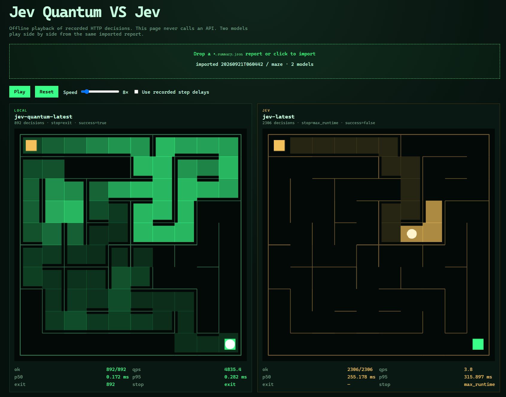

# Jev Quantum

[中文](README.md) | [English](README.en.md)



> 亚微秒级 System −1 模型，准确率服从高斯分布。

Jev Quantum 是兼容 Jev 协议的**随机基线**。它讲 TypeSafe System One 的话（`noul` / `choice` / `score`），不读提示词，答案来自高速伪随机数。拿它当 dummy、mock，或 Agent 路由评测的下界。

它不是语义模型。随机数也不是密码学安全的。

## 未知迷宫：算法、Jev 与 LLM 对比

项目现在也包含未知迷宫实验与可离线播放的对比平台，用同一张 **10×10、seed=20260935** 的地图，观察预制算法、探索规则、历史记忆和通用策略分别怎样影响决策。出口坐标已知，各策略只通过当前位置的墙壁观察逐步探索。

[观看实录视频（2944×1840，20.5 秒）](reports/article-selected-seven.screencast.mp4) · [1080p 精简回放（16 秒）](reports/article-selected-seven.replay.mp4) · [实验文章](docs/jev-maze-article.md)

[](reports/article-selected-seven.screencast.mp4)

| 分组 | 方法 | 动作步数 | 结果 | P50（ms） |
| --- | --- | ---: | --- | ---: |
| C0 | 随机代码 | 1890 | 到达 | 0.082 |
| C1 | 迷宫算法 Flood Fill | 46 | 到达 | 0.006 |
| C2 | GPT-5.6 Luna，持续会话 | 96 | 到达 | 2611.122 |
| E0 | Jev + 局部状态 | 273 | 10 分钟预算耗尽 | 402.625 |
| E1 | Jev + 完整历史 | 371 | 30 分钟预算耗尽 | 725.867 |
| E2 | Jev + 探索规则 | 48 | 到达 | 391.513 |
| E3 | Jev + 完整历史 + 通用策略 | 70 | 到达 | 669.436 |

P50 为整次记录的中位数：C1 是进程内计算，C2 含工具调度，其余是客户端 HTTP 响应时间，不能直接当作同口径的模型推理速度排名。视频按动作步数加速回放，不代表实际运行耗时。

这次实验显示：增加历史并不自动消除循环；明确探索规则和调整通用策略都能改善本张地图上的结果。E2 使用空间统计与探索优先级，并不保留全部逐步历史，也不计算 BFS。E3 保留完整历史并移除距离评价信号。单张地图、每组一次记录尚不能证明跨 seed 的稳定性或普遍优劣。

- [七组原始报告](reports/article-selected-seven.summary.json)与[独立 HTML 播放器](reports/article-selected-seven.player.html)：下载 HTML 后直接用浏览器打开，无需 API key。
- [全部十一版本报告](reports/0923showcase.eleven-strategies.summary.json)与[完整播放器](reports/0923showcase.player.html)，保留历史版本和消融对照。
- 播放器支持一屏适配、自由缩放、步数跳转、最高 64× 播放，以及每组步数和 P50 展示。
- [策略与实验限制](docs/maze-strategies.md)、[复现实验](docs/benchmarking.md)、[报告索引](reports/README.md)。

## 一分钟上手

```bash
cargo run --release -p jev-quantum-server
```

```bash
curl http://127.0.0.1:3000/v1/systemone \
  -H "Content-Type: application/json" \
  -d "{\"model\":\"jev-quantum-latest\",\"state\":\"I was charged twice.\",\"questions\":{\"refund\":{\"type\":\"noul\",\"instructions\":\"Refund?\"}}}"
```

打开 `http://127.0.0.1:3000/demo/`，导入一份 `*.summary.json` 报告。页面不会调用任何 API，支持文章七组及完整十一版本同屏回放。

## 和 TypeSafe Jev 对比

```bash
cp .env.example .env
# 填写 AI_GATEWAY_API_KEY
cargo run --release -p jev-quantum-bench -- latency --targets local,jev --requests 100
cargo run --release -p jev-quantum-bench -- maze-record --targets local,jev --width 10 --height 10 --max-steps 200 --output reports/
```

新增迷宫策略可用 `--targets flood-fill,jev-memory,jev-flood-fill`：前者在线感知墙壁并重算 BFS 距离场，Jev Memory 使用定长空间记忆，Jev Flood Fill 根据本地更新的 BFS 距离场选择动作。用 `--maze-seed` 固定基线，详见 [Benchmarking](docs/benchmarking.md)。

官方接口形态：

```bash
curl https://api.typesafe.ai/v1/systemone \
  -H "Authorization: Bearer $AI_GATEWAY_API_KEY" \
  -H "Content-Type: application/json" \
  -d "{\"model\":\"jev-latest\",\"state\":\"I was charged twice.\",\"questions\":{\"refund\":{\"type\":\"noul\"}}}"
```

## 数字怎么读

| 数字       | 含义                   |
| ---------- | ---------------------- |
| Core bench | 进程内 PRNG + 映射     |
| `/metrics` | 服务端 handler 耗时    |
| Bench 报告 | 客户端观测到的 HTTP 延迟 |

默认 `direct` 模式。`buffered` 使用 worker 本地随机池，后台 SIMD 补水，同步路径可降级。两种口号都先跑完再信。

## 文档

- [API](docs/api.md)
- [Benchmarking](docs/benchmarking.md)
- [Report schema](docs/report-schema.md)

## 许可

[MIT](LICENSE)
